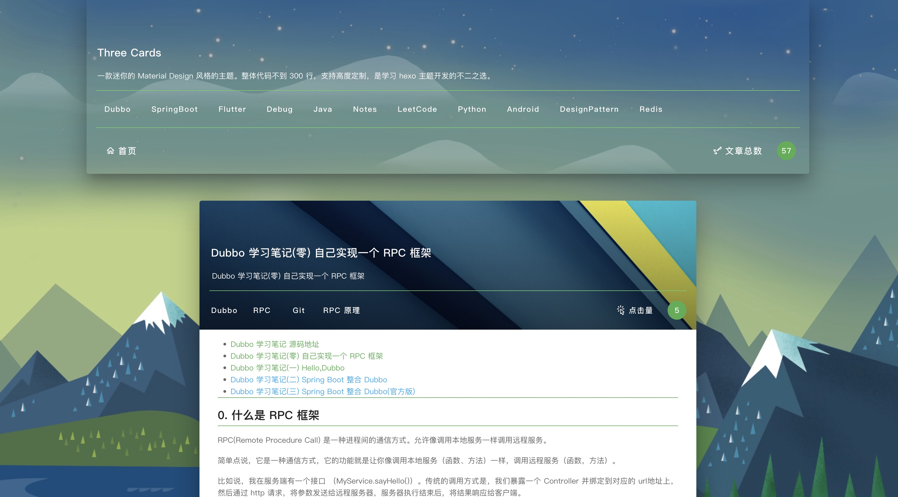
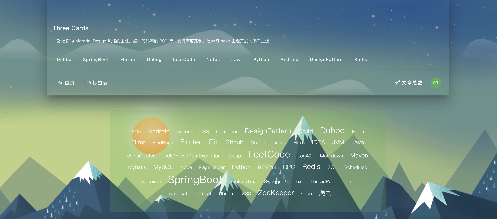
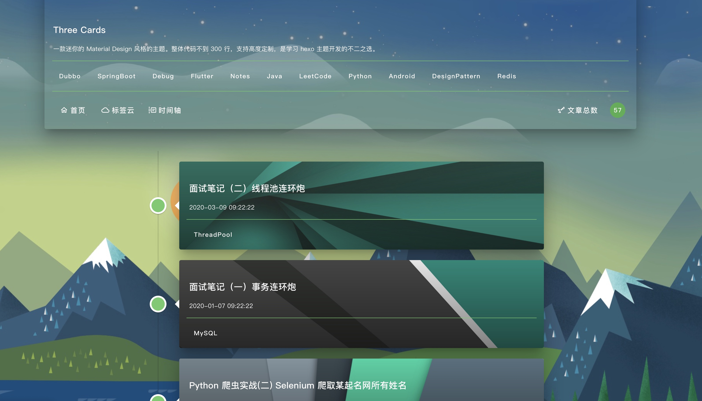
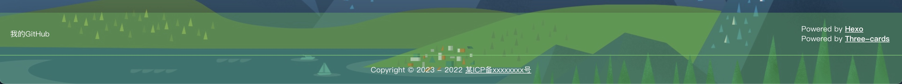

# ThreeCards
一款迷你的 Material Design 风格的主题。整体代码不到 300 行，支持高度定制，是学习 hexo 主题开发的不二之选。

## 一、效果图




## 二、如何使用
进入到 hexo 的 theme 目录下。 clone 本项目

```
git clone git@github.com:zdRan/three-cards.git
```
修改 hexo 的 _config.yml 配置文件：

```
theme: three-cards
```

## 三、配置
### 1、配置标签云
在 hexo 主目录下执行以下命令

```
hexo new page tags
```
修改 ```/source/tags/index.md``` 文件内容为：

```
---
title: tags
layout: tags
type: tags
---
```

修改 three-cards 主题 _config.xml 文件

```
header:
  menus:
    - title: 首页
      icon: home-outline
      href: /
    - title: 标签云
      icon: cloud-outline
      href: /tags
```



### 2、配置时间轴
在 hexo 主目录下执行以下命令：

```
hexo new page timeline
```

修改 ```/source/timeline/index.md``` 文件内容为：

```
---
title: timeline
layout: timeline
type: timeline
---
```

修改 three-cards 主题 _config.xml 文件

```
header:
  menus:
    - title: 首页
      icon: home-outline
      href: /
    - title: 标签云
      icon: cloud-outline
      href: /tags
    - title: 时间轴
      icon: timeline-text-outline
      href: /timeline
```


## 3、配置其他链接
 修改 three-cards 主题 _config.xml 文件

 ```
footer:
  links:
    - title: 我的GitHub
      href: https://github.com/zdRan/three-cards

 ```
 

 ## 四、注意事项
 + 请使用 hexo 6.0 以上的版本
